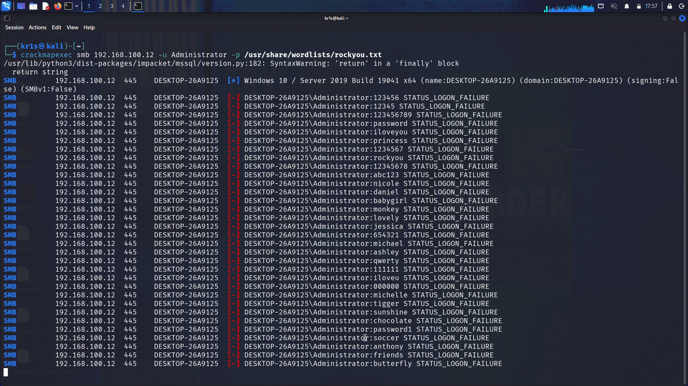
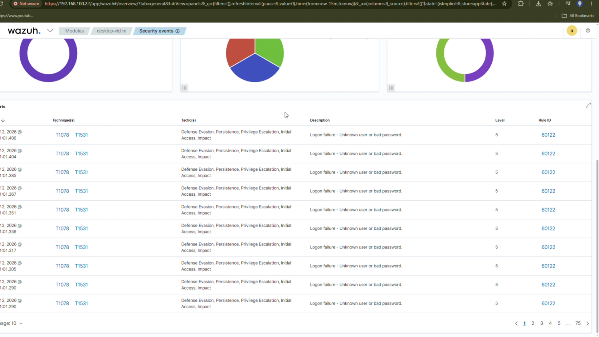
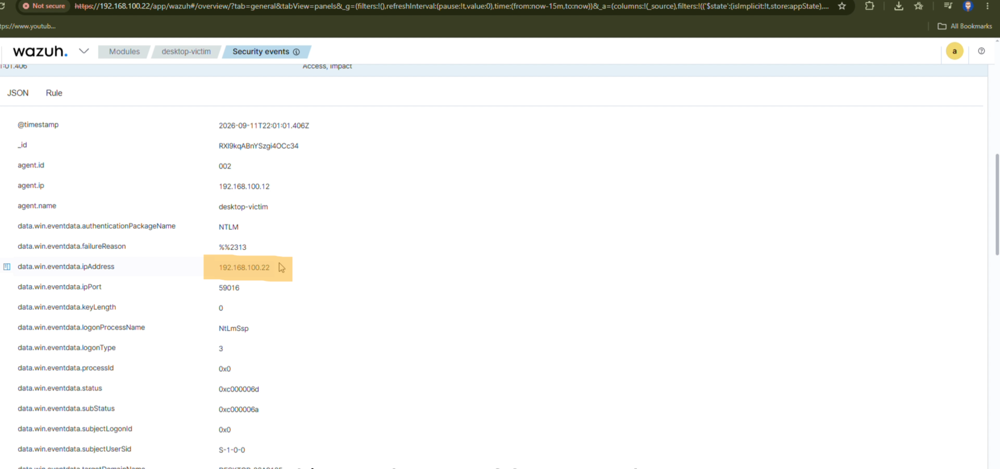

# Wazuh SOC Home Lab - Brute Force Detection & Investigation

##  Video Walkthrough

*Watch the full attack and detection in action.*

---

##  Objective
Build a functional Security Operations Center (SOC) home lab to simulate, detect, and investigate a brute-force attack against a Windows endpoint using the Wazuh SIEM platform.

##  Lab Architecture

| Role | Machine | Purpose |
| :--- | :--- | :--- |
| **SIEM Server** | Kali Linux (Wazuh Manager + Indexer + Dashboard) | Collects logs, fires alerts, displays dashboard |
| **Victim (Agent 001)** | Windows 10 Laptop | Endpoint #1 |
| **Victim (Agent 002)** | Windows 10 Extra Desktop | Endpoint #2 (Attack Target) |
| **Attacker** | Kali Linux (CrackMapExec) | Launches SMB brute-force attack |

##  Tools Used
- **Wazuh** (SIEM - Log Collection, Detection, Dashboard)
- **CrackMapExec** (SMB Brute-Force Attack)
- **Kali Linux** (Attacker + SIEM Server)
- **Windows 10** (Victim Endpoints)
- **MITRE ATT&CK** (T1110 - Brute Force)

##  Methodology

### 1. SIEM Deployment
Installed Wazuh Manager, Indexer, and Dashboard on a Kali Linux VM. Deployed Wazuh agents to two Windows 10 endpoints (Laptop and Extra Desktop). Verified both agents showed "Active" status in the dashboard.

### 2. Attack Simulation
From the Kali attacker machine, launched an SMB brute-force attack against the Windows Extra Desktop (192.168.100.12) using CrackMapExec.
**Command used:**
`crackmapexec smb 192.168.100.12 -u Administrator -p /usr/share/wordlists/rockyou.txt`
The tool attempted hundreds of passwords from the `rockyou.txt` wordlist, generating `STATUS_LOGON_FAILURE` responses.

### 3. Detection (Wazuh)
The Wazuh dashboard detected the attack in real-time. **Rule ID 60122 ("Windows Logon Failure")** was triggered for each failed attempt. Over 800 authentication failures were recorded within a short time window.

### 4. Investigation
Clicked into a Rule 60122 alert and examined the JSON event data. Identified the **attacker's source IP (192.168.100.22)** in the `data.win.eventdata.ipAddress` field, confirming the origin of the attack.

##  Key Findings
- Wazuh successfully detected the brute-force attack via Rule ID 60122.
- The attacker's IP address was captured in the Windows Security Event Log (Event ID 4625).
- The attack targeted the `Administrator` account over SMB (Port 445).
- This maps to **MITRE ATT&CK T1110 (Brute Force)** — the primary technique.
- Wazuh also mapped the alert to **T1531 (Account Access Removal)** as a defensive warning, since continued failed logons could lead to account lockout.

##  Defensive Recommendations
1. **Account Lockout Policy:** Configure Windows to lock accounts after 5 failed attempts.
2. **Disable SMBv1:** Ensure legacy SMB protocols are disabled.
3. **Network Segmentation:** Restrict SMB traffic to trusted hosts only.
4. **SIEM Alerting:** Configure Wazuh to send email/Slack alerts for Rule 60122.
5. **MFA & Strong Passwords:** Enforce complex passwords and multi-factor authentication.
6. **IPS/IDS:** Deploy network-based intrusion prevention to auto-block brute-force sources.

##  Proof of Work

###  Full Video Walkthrough
The complete attack, detection, and investigation are demonstrated in the video at the top of this README.

###  Screenshots

###  Additional Evidence
- **MITRE ATT&CK Mapping:** T1110 (Brute Force), with a defensive mapping to T1531 (Account Access Removal)
- **Windows Event ID:** 4625 (Failed Logon)
- **Logon Type:** 3 (Network Logon - SMB)
- **Attacker IP:** 192.168.100.22 (Kali Linux)
- **Victim IP:** 192.168.100.12 (Windows 10 Extra Desktop)
- **Detection Rule:** Wazuh Rule 60122
- 
##  Skills Demonstrated
- SIEM Deployment & Configuration
- Agent Deployment (Windows Endpoints)
- Threat Detection & Alert Triage
- Log Analysis & Incident Investigation
- MITRE ATT&CK Mapping
- Blue Team Defensive Operations
From the Kali attacker machine, launched an SMB brute-force attack against the Windows Extra Desktop (192.168.100.12) using CrackMapExec.

